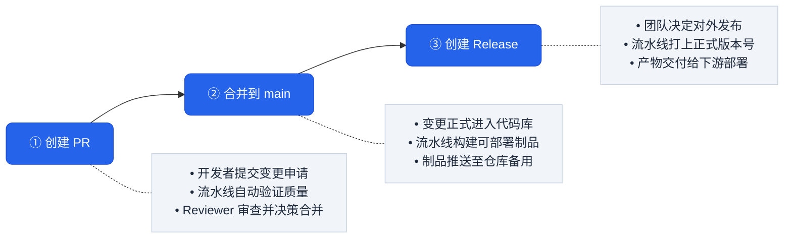
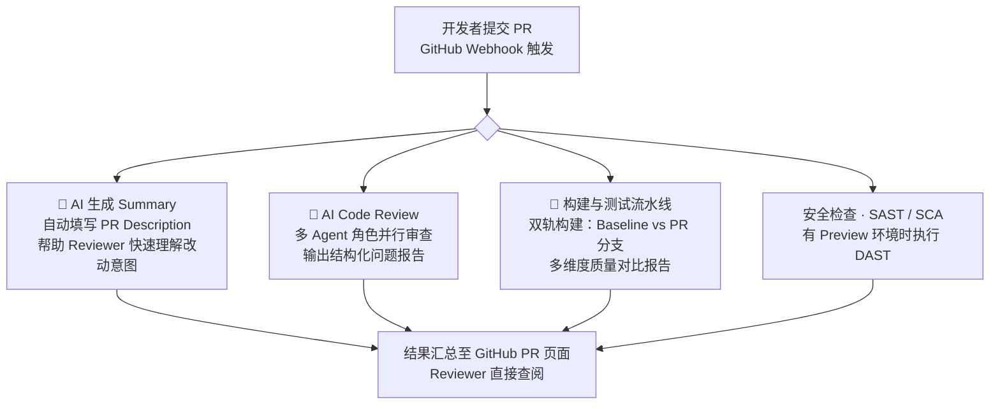
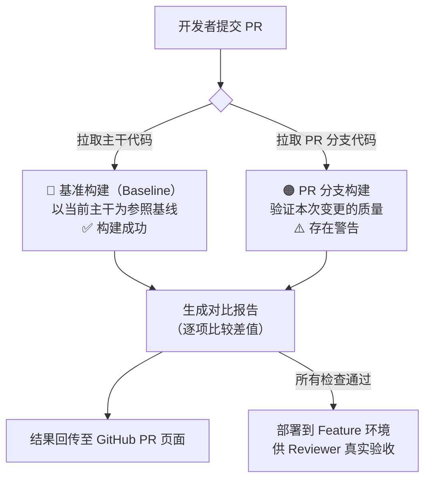
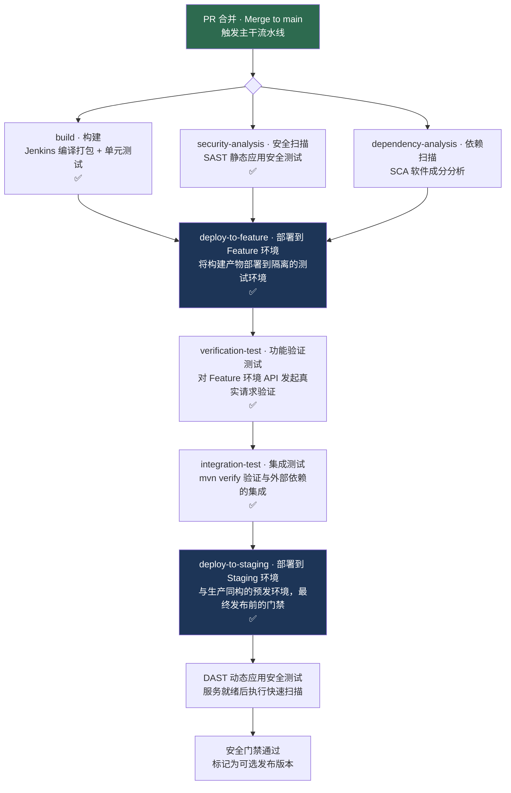
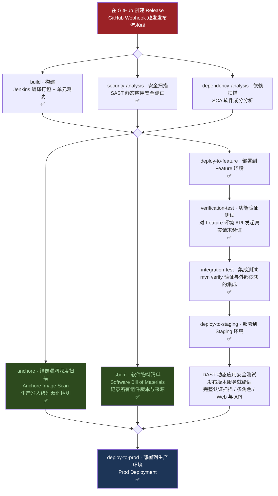
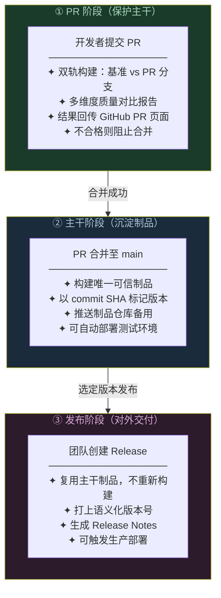

# 软件发布流水线概览

> 如何定义一条好的产品交付流水线

---

## 写在前面

本文不深入讲解某个 CI/CD 工具的配置细节，而是从**定义一条好的产品交付流水线**的视角出发，回答两个核心问题：

> 一条好的交付流水线，应该在哪些时机介入、做哪些事？
> 各个环节的职责边界应该怎么划？

一条设计良好的流水线，能让团队在快速迭代的同时保持质量可控、交付可追溯、问题可回滚。反之，职责不清、检查缺失或环节冗余的流水线，会让每次发布都充满不确定性。

理解这条流水线的全貌，也有助于研发、测试、产品等角色在讨论"为什么这个功能还没上线"或"上线了为什么有问题"时，有共同的语言和判断依据。

## 适用范围

本文从**软件工程视角**抽象地看待交付流水线，描述的是托管平台（Managed Platform）上的典型实践。

托管平台本身在底层同样会涉及镜像构建、镜像发布、基础设施变更等操作，但这些细节由平台团队维护，对应用开发者屏蔽。本文不涉及这一层，专注于开发者可见的流水线结构：代码如何从提交走到可部署的状态，各环节的职责边界是什么。

如果你需要了解非托管环境下如何自行管理镜像构建、仓库推送与 Kubernetes 发布，见：[非托管环境的容器化交付流水线](../02-container-delivery-pipeline/README.md)。

---

## 三个关键时间点

从 GitHub 的视角来看，一次完整的软件交付围绕三个时间点展开：



每个时间点都有一条自动化流水线在背后运转。三条流水线各司其职，共同保障"改得对、存得住、发得出"。

---

## QA 测试：测什么，以及产出哪些报告

三条流水线会重复使用同一套测试能力，但验证对象不同：**PR 验证待合并的变更，主干验证合并结果，发布验证选定版本是否具备上线条件**。先明确每类测试的职责，再看它们在流程中的执行位置。

### Unit Tests（单元测试）

**Unit Tests（单元测试）** 检查函数、类或小范围模块的行为，例如审批阈值、参数校验和异常分支。通常不需要部署完整应用；外部依赖可以通过 mock、stub 等测试替身隔离，纯计算逻辑则不一定需要测试替身。

它的优势是执行快、失败容易定位，适合每次 PR 和主干构建运行；局限是不能仅凭单元测试通过就确认真实数据库、网络或部署配置正常。

典型的 Unit Tests 包括：

- **正常业务逻辑**：给定订单类型和申请容量，验证是否选择正确的审批策略、返回预期结果
- **边界条件**：验证容量恰好等于审批阈值、集合为空、数值为零等情况，避免只覆盖正常输入
- **参数校验**：输入缺失字段、非法状态或不支持的类型时，是否返回明确的错误或抛出预期异常
- **异常处理**：用测试替身模拟依赖超时或调用失败，验证重试、降级和错误传播是否符合设计
- **状态变化与必要交互**：审批完成后，验证状态是否正确更新、是否调用持久化接口；真实数据是否写入数据库则交给集成测试验证

例如，`ApprovalHelperTest` 可以分别验证“低于阈值自动通过”“等于阈值按边界规则处理”“超过阈值转人工审批”。每个用例准备明确的输入，执行被测方法，再断言输出或状态变化；测试之间应互相独立，避免依赖执行顺序、共享数据或真实网络。

**如何运行**

在配置了 Maven Surefire 插件及相应测试用例后，可通过 `mvn test` 编译代码并运行单元测试、检查结果；命令本身不会自动创建单元测试。测试框架依赖、用例选择和测试替身也需要项目配置。执行方式与报告格式可见 [Maven Surefire 官方说明](https://maven.apache.org/surefire/maven-surefire-plugin/)。

**报告与失败处理**

Surefire 默认在 `target/surefire-reports/` 下生成 XML 和文本报告，记录用例结果、耗时及失败信息；HTML 页面可由报告插件或 CI 平台生成。具体格式见 [Maven Surefire 官方说明](https://maven.apache.org/surefire/maven-surefire-plugin/)。

排查时先看失败用例的**预期值与实际值、异常堆栈、测试输入**，判断是业务逻辑变化、测试预期过期，还是测试环境与替身配置有误。单元测试失败通常应阻断当前构建；报告缺失、用例未被发现或全部跳过，也不能直接当作验证通过。覆盖率由 JaCoCo 等工具另行采集，Surefire 的用例通过数量并不代表代码覆盖率。

### Verification Tests（功能验证测试）

**Verification Tests（功能验证测试）** 在本文中特指部署后的功能验证：Feature、Preview 或 Staging 环境已经部署完毕、服务已经启动后，测试程序直接对 API 发起真实 HTTP 请求，验证接口的响应是否符合预期。不同团队对这个名称的用法可能不同。

它将服务当成黑盒，验证实际部署后的行为，例如配置是否生效、路由是否可达、核心接口能否正常响应。

典型的 Verification Tests 包括：

- **健康检查**：调用 `/health` 或 `/ping` 接口，确认服务正常启动、依赖连通
- **核心接口验证**：对最重要的业务接口发起请求，断言响应状态码、字段值、数据格式是否正确
- **关键业务流程**：串联多个接口，模拟一条完整的业务请求链路，验证端到端结果

这类测试通常优先选择少量关键路径，以便快速判断部署是否可用；失败后应停止该部署链路的后续晋级。

### Integration Tests（集成测试）

**Integration Tests（集成测试）** 验证模块、服务或外部依赖之间的协作是否正确。测试可以在 CI 中启动临时数据库、消息队列等依赖，也可以连接专用测试环境；是否需要部署整个应用取决于测试设计。

典型的 Integration Tests 包括：

- **下游服务调用**：调用真实的依赖服务（或其 Staging 实例），验证请求格式、认证、错误处理是否符合预期
- **消息队列收发**：发布消息并验证消费者正确处理，或验证本服务正确响应上游发来的消息
- **数据库事务边界**：验证跨表写入、事务回滚等场景在真实数据库中的行为
- **API 契约测试**：确认本服务对外暴露的 API 响应格式与调用方的期望一致（防止字段改名等破坏性变更）

**如何运行**

在配置了 Maven Failsafe 插件及相应测试用例后，可通过 `mvn verify` 运行集成测试并检查结果；命令本身不会自动创建集成测试。测试环境、依赖启动和清理也需要项目配置。执行方式与报告格式可见 [Maven Failsafe 官方说明](https://maven.apache.org/components/surefire-archives/surefire-LATEST/maven-failsafe-plugin/index.html)。

集成测试失败时，应结合失败用例、依赖服务日志和调用链定位接口契约变化、环境配置不匹配或上下游版本不兼容等问题。

### Smoke Tests、端到端测试与回归测试

**Smoke Tests（冒烟测试）** 是用于快速判断版本是否具备基本可用性的一小组关键用例，例如服务启动、登录和核心接口调用。它描述的是测试范围与目的，可以从功能验证、集成或端到端测试中选取用例，不固定属于某一种测试层级。

**End-to-End Tests（端到端测试，E2E）** 从用户入口贯穿完整业务链路，例如“提交订单 → 支付 → 查询订单状态”。它通常涉及多个服务，能发现局部测试遗漏的协作问题，但执行成本和环境维护成本也更高。

**Regression Tests（回归测试）** 用于确认改动没有破坏已有行为，可以复用单元、集成和端到端测试用例。PR 阶段可以先执行受影响范围的用例，主干或发布前再执行更完整的回归集。

### 测试顺序如何安排

通常先执行反馈快、成本低的检查，再投入更昂贵的环境验证。本文的部署链采用“单元测试 → 部署 → 功能验证 → 集成测试”的顺序，以便先发现基本部署问题，再验证更广的协作行为。能独立启动依赖的集成测试也可以在构建阶段并行运行，这不是所有项目必须遵循的固定顺序。

**测试金字塔** 强调不同测试层级的数量与成本分布，并不规定 CI 的执行顺序；具体顺序应由依赖关系、耗时和故障定位需求决定。

### 配套质量检查：构建、静态分析与覆盖率

除了运行测试，流水线还需要检查构建结果、静态代码质量和覆盖率。下面以 Java 项目为例列出常见检查项；这些检查可用于三条流水线，PR 阶段还可以对比基准与变更后的结果：

| 检查项 | 数据来源工具 | 检测内容 | 关注的核心问题 | 失败后果 |
|--------|-------------|----------|----------------|----------|
| **BUILD（构建）** | Maven / Gradle | 代码能否正常编译 | 是否引入了编译错误、缺少依赖 | 后续检查全部跳过，PR 必须修复才能合并 |
| **JUNIT（单元测试）** | JUnit / TestNG，由 Maven Surefire Plugin 执行 | 自动化测试运行结果 | 新增失败用例数、跳过用例是否增加 | 说明本次改动破坏了已有行为 |
| **STATIC ANALYSIS（静态分析）** | Checkstyle / SonarQube | 代码风格与规范 | P1/P2 级别警告数是否相比基准增加 | 警告激增意味着需要进一步检查 |
| **PMD（代码反模式检测）** | PMD，Maven PMD Plugin | Java 代码的已知反模式 | 未使用变量、过深嵌套、过长方法等 | 反模式积累会使代码越来越难维护 |
| **SpotBugs（字节码 Bug 检测）** | SpotBugs，Maven SpotBugs Plugin | 字节码层面的 Bug 模式 | 空指针风险、资源未关闭、并发隐患等 | 严重级别（Error）的新增警告应阻止合并 |
| **JACOCO（代码覆盖率）** | JaCoCo，Maven JaCoCo Plugin | 测试对代码分支的覆盖程度 | 分支覆盖率是否低于团队阈值（如 80%） | 需检查新增代码和分支是否缺少测试 |

> **严重级别说明**：各工具的警告均按优先级分级（Error / P1 / P2 / P3），级别越高越需要立即处理。通常 Error 和 P1 级别新增才会触发合并阻断，P2/P3 作为警告提示。

### 常见测试报告

**测试结果报告**回答“哪些用例成功或失败”，**覆盖率报告**回答“执行到了哪些代码”，**静态分析报告**记录“不运行应用也能发现的问题”。覆盖率高不代表断言充分，也不代表业务行为一定正确。

| 检查类型 | 常见报告或产物 | 阅读重点 |
|------|------|------|
| **单元测试** | JUnit 格式 XML、HTML 用例报告；Maven 项目常见 `target/surefire-reports/` | 总数、通过/失败/跳过数、耗时、断言差异和异常堆栈 |
| **功能验证测试** | API 用例报告、请求响应摘要、健康检查结果、部署日志 | 目标环境与版本、失败接口、预期与实际响应、失败是否来自服务未就绪 |
| **集成测试** | XML / HTML 用例报告、依赖日志；Failsafe 常见 `target/failsafe-reports/` | 失败的协作场景、数据库或消息状态、调用链、超时与清理结果 |
| **冒烟测试** | 关键用例清单及通过/失败汇总 | 必需路径是否全部执行，是否具备继续测试或晋级的条件 |
| **端到端与回归测试** | 场景报告、历史趋势；浏览器测试还可附截图、录像或 trace | 失败业务步骤、相对基准的变化、重试后才通过的不稳定用例 |
| **代码覆盖率** | JaCoCo 的 HTML、XML 或 CSV 报告 | 行/分支覆盖率、未覆盖代码、变更代码的覆盖情况 |
| **静态代码质量** | Checkstyle、PMD、SpotBugs 的问题清单，以及 SonarQube 分析结果 | 规则、严重程度、文件位置、新增问题与存量问题 |

具体文件名由插件配置决定。Failsafe 的 XML 报告可交给 CI 汇总，JaCoCo 支持 HTML、XML 和 CSV 输出，参见 [Failsafe 报告说明](https://maven.apache.org/components/surefire-archives/surefire-LATEST/maven-failsafe-plugin/index.html)与 [JaCoCo 报告说明](https://www.jacoco.org/jacoco/trunk/doc/report-mojo.html)。

CI 应将报告关联到 **commit SHA、制品版本、环境及本次运行编号**，保留失败日志，并在页面上区分通过、失败、跳过和未执行。重试记录也应保留，避免把偶发通过当作稳定结果。PR 中可以进一步生成“基准值 / PR 值 / 变化量”的对比报告；主干和发布阶段则重点确认当前制品的必需检查全部完成。

---

## 安全测试：SAST、DAST 与 SCA

流水线中的“安全扫描”需要区分检查对象：**SAST 看代码，DAST 看运行中的应用，SCA 看第三方组件**。三者互相补充，不能仅凭某一项扫描通过就认为应用没有安全问题。

### SAST（静态应用安全测试）

**SAST（Static Application Security Testing，静态应用安全测试）** 像检查应用“设计图”的侦探：无需运行应用，就能分析源代码；部分工具也支持字节码或二进制文件，从中寻找潜在的安全缺陷，例如不安全的数据流和可能导致注入的代码路径。

- **优点**：在开发或 PR 阶段就能发现问题，通常能够定位到具体代码，降低后期修复成本。
- **局限**：可能产生误报，也难以完整发现依赖实际运行环境、配置或交互过程才会暴露的问题。
- **流水线位置**：适合放在 PR 检查和主干构建阶段；能否与编译并行取决于工具是否需要构建产物。

### DAST（动态应用安全测试）

**DAST（Dynamic Application Security Testing，动态应用安全测试）** 像观察应用实际行为的侦探：对已经运行的 Web 应用或 API 发送测试请求，检查响应和行为，寻找可从外部触发的安全问题。

- **优点**：能够发现部分只有在应用运行时才出现的问题，补充 **SAST** 对运行环境和实际交互的覆盖。
- **局限**：需要可用的测试环境，扫描可能较耗时；覆盖范围受接口发现、登录状态和测试数据影响。自动扫描不一定能发现业务逻辑缺陷或**基于角色的访问控制（RBAC）**问题，仍需设计专门的权限与业务安全测试。
- **流水线位置**：适合在 Feature 或 Staging 环境部署完成后、生产发布前执行。功能验证测试通过，并不等于已经完成 **DAST**。

### SCA（软件成分分析）

**SCA（Software Composition Analysis，软件成分分析）** 像核对应用“配料表”的侦探：识别第三方组件及其版本，包括直接依赖和传递依赖，检查已知漏洞及许可证风险。分析对象可以包括依赖清单、锁文件、构建产物或容器镜像。

- **优点**：较早发现依赖风险，帮助团队确定升级或替换组件的优先级，也能支持许可证合规检查。
- **局限**：依赖组件识别的准确性和漏洞数据的完整性；发现受影响的版本不等于该漏洞在当前应用中一定可被利用，也不能保证发现尚未披露的漏洞。
- **流水线位置**：适合在 PR 和构建阶段检查依赖，在镜像构建后检查实际交付的组件；发布后也应持续关注新披露的依赖漏洞。

| 测试类型 | 核心检查对象 | 是否需要运行应用 | 主要关注点 |
|------|------|------|------|
| **SAST** | 自有代码 | 否 | 代码中的潜在安全缺陷 |
| **DAST** | 运行中的应用或 API | 是 | 外部请求可触发的安全问题 |
| **SCA** | 第三方组件及依赖 | 否 | 已知组件漏洞与许可证风险 |

### 三条流水线中的安全检查

这三类安全检查贯穿交付过程，各阶段的执行范围和门禁不同：

| 流水线 | **SAST** | **SCA** | **DAST** | 门禁 |
|------|------|------|------|------|
| **PR 流水线** | 检查待合并代码 | 检查依赖漏洞与许可证风险 | 有 Preview 环境时，在服务就绪后执行快速扫描；没有运行环境则标记为未执行，由主干阶段完成 | 必需检查通过后才允许合并 |
| **主干流水线** | 检查合并后的代码 | 检查完整依赖与实际交付组件 | Staging 部署并就绪后执行限时快速扫描 | 通过后才标记为可选发布版本 |
| **发布流水线** | 验证选定版本的代码安全 | 检查发布制品的组件风险 | 在 Staging 对选定版本执行完整认证扫描 | 全部门禁通过后才部署生产 |

镜像依赖漏洞扫描与 **SCA** 有交集，但镜像配置检查属于其他检查维度。**SBOM（软件物料清单）** 提供组件清单，本身不等于漏洞扫描结果或安全测试通过证明。

**DAST 的两级门禁**：主干执行限时快速扫描，尽早反馈关键接口风险；发布流水线针对选定制品，在 Staging 执行更完整的认证扫描，覆盖多角色会话和更多接口。扫描期间固定环境中的制品版本，使用专用测试账号和数据，并将报告关联到制品版本。两级门禁都要求扫描成功完成且没有达到阻断阈值的问题（例如高危或严重漏洞）；超时、登录失败或目标不可达不能视为通过。

---

## 第一关：PR 流水线

### 它解决什么问题？

没有自动化检查时，代码质量完全依赖人工 Review，容易漏掉测试失败、覆盖率下降、引入新 Bug 等问题。PR 流水线让机器先做一轮客观检查，把问题拦在合并之前。

### PR 钩子触发的并行任务

开发者提交 PR 的那一刻，GitHub Webhook 会同时触发多条任务并行执行，无需等待彼此完成：



这些任务的产出最终都回传到同一个 PR 页面，Reviewer 打开时可以同时看到：改动意图（Summary）、AI 审查意见（Code Review Report）、客观质量数据（构建测试报告）和安全检查结果。

**PR 安全门禁**：**SAST** 与 **SCA** 发现违反准入策略的问题时阻止合并；有 Preview 环境时，在部署与就绪检查后执行 **DAST** 快速扫描，扫描失败或发现阻断项同样阻止合并。没有运行环境时，**DAST** 明确标记为未执行，由主干阶段完成。

---

### 任务一：AI 生成 PR Summary

开发者在提交 PR 时，往往只写一两句描述甚至留空，让 Reviewer 自己去读 diff 理解改动意图。随着 PR 规模增大，这种做法严重拖慢 Review 效率。AI 自动生成 Summary，让 Reviewer 在看任何代码之前就能建立背景认知：

| 项目 | 说明 |
|------|------|
| **输入** | Git diff、关联的 JIRA / Issue 标题、历史提交信息 |
| **输出内容** | 本次改动的目的、涉及的模块、生产变更要点、测试覆盖说明 |
| **写入位置** | 自动填入 PR Description，开发者可在此基础上补充或修改 |

一份好的 AI 生成 Summary 通常包含以下结构：

- **一句话概述**：这次 PR 做了什么、解决了什么问题
- **关联上下文**：所属 Epic、依赖的前置 PR
- **生产变更要点**：新增了哪些类/组件、删除或重构了什么、工作流/配置是否有变化
- **测试说明**：新增了多少测试、覆盖了哪些关键场景

以下是一个示例：

---

> **Summary**
>
> 将审批决策逻辑从 `OrderExecutor` 中抽离为独立的 `ApprovalHelper`，完成审批流重构的最后一块拼图，并新增 `MetadataSync` 在审批完成后将结果持久化回订单文档。
>
> 属于 Epic ORDER-1042 的一部分，依赖 PR #88（ApprovalHelper 接口定义）。
>
> **生产变更**
>
> 新增：`ApprovalHelper`
> 集中处理订单审批决策：降级检测（当前容量 vs 申请容量对比，缩容时强制人工审批）、阈值以下变更自动通过并发送通知、审批前合并各子项的容量估算。
>
> 新增：`MetadataSync`
> 审批完成后，将审批结果和备注写回订单配置文档，同时更新环境配置中的分片数和副本数。由 `OrderExecutor.complete` 和 `PromoteExecutor.promoted` 共同调用。
>
> 重构：`OrderExecutor`（+120 / -8）
> 引入策略模式按订单类型分发处理逻辑；审批检查和元数据同步均通过新组件委托，自身职责收窄。
>
> 移除：`LegacyApprovalUtils`
> 逻辑已全量迁移至 `ApprovalHelper`，原工具类冗余。
>
> **测试变更**（新增 / 扩展共 4 个测试类，全部通过）
>
> | 测试类 | 覆盖场景 |
> |--------|----------|
> | `ApprovalHelperTest`（新增） | 缩容检测、阈值边界、子项容量合并 |
> | `MetadataSyncTest`（新增） | 备注写入、配置更新、非生产环境跳过、异常容忍 |
> | `OrderExecutorTest`（新增） | 各类型审批分发、元数据同步、错误处理 |
> | `PromoteExecutorTest`（扩展） | 晋级时触发元数据同步 |

---

这样 Reviewer 打开 PR 时，无需逐行读 diff 就能快速理解改动意图，把精力集中在真正需要判断的地方。

### 任务二：AI Code Review

PR 创建后，除了触发构建流水线，另一个正在被广泛采用的实践是：**让 AI 自动完成第一轮 Code Review**，在人工 Reviewer 介入之前先输出一份结构化的审查报告。

#### 多 Agent 角色分工

一次 AI Code Review 通常不是由单一模型完成的，而是采用**多 Agent 模式**，让不同角色的 Agent 分别从自己的视角独立审查，最后聚合意见。常见的角色分工如下：

| 角色 | 审查视角 | 典型关注点 |
|------|----------|------------|
| **初级工程师（Junior SWE）** | 代码可读性与基础规范 | 命名是否清晰、有无明显的低级错误（拼写、未使用变量、格式问题）、依赖注入方式是否符合项目惯例 |
| **资深工程师（Senior SWE）** | 架构合理性与隐性风险 | 设计模式是否恰当、是否存在性能隐患（如每次调用都创建新对象）、边界情况是否被正确处理、安全敏感数据（如密钥）的存储方式 |
| **架构师（Architect）** | 系统一致性与长期可维护性 | 新代码是否破坏了模块边界、是否与现有架构风格一致、是否引入了难以撤销的技术债务 |
| **QA 工程师（QA Engineer）** | 测试覆盖完整性 | 异常路径是否有测试、边界条件是否被覆盖、新增类是否有对应的测试文件、测试基础设施是否健壮（避免反射等脆弱写法） |

每个角色独立产出意见后，系统统计每条发现被几个角色认同（如 `3/3` 表示三个角色一致认为是问题），认同度越高，优先级越高。

#### 问题分级与决策

AI Code Review 通常将发现按严重程度分为三级：

| 级别 | 含义 | 处理原则 |
|------|------|----------|
| 🔴 **High（必须修复）** | 行为正确性 Bug、启动崩溃风险、空指针等未处理异常、关键路径零测试覆盖 | 合并前必须解决 |
| 🟡 **Medium（建议修复）** | 日志缺失导致生产排查困难、不一致的技术选型（如混用两种序列化库）、保守逻辑方向错误 | 当前 PR 处理或后续 ticket 跟进 |
| 🟢 **Low（推荐改进）** | 冗余代码、日志格式小问题、未使用的字段 | 可选，不阻断合并 |

最终 AI 给出一个审查决策：✅ Approve / 🟡 Comment / 🔴 Request Changes，并附上各级别问题汇总。

#### 报告示例

> **🔍 PR Review Complete｜审查决策：🔴 Request Changes**
>
> 整体架构和设计思路清晰，但存在行为正确性 Bug、启动崩溃风险和关键路径零测试覆盖，建议合并前解决。
>
> Reviewed by: Junior SWE · Senior SWE · QA Engineer

**🔴 High（合并前必须修复）**

| # | 问题 | 认同度 |
|---|------|--------|
| H1 | 非生产环境自动通过逻辑位于 `catch` 之后，异常发生时 `catch` 直接 `fail()` 返回，自动通过代码永远不会执行 | 2/3 |
| H2 | 网关客户端构造函数未校验密钥格式，密钥缺失或格式错误时作为单例抛出 NPE，导致服务启动崩溃 | 3/3 |
| H3 | `strategyMap.get(entityType)` 对未注册类型返回 null，NPE 未处理或错误信息静默丢失 | 3/3 |
| H4 | 图存储实现使用静态方法调用，产生隐式依赖，无法进行单元测试，违反依赖反转原则 | 2/3 |
| H5–H8 | 多个核心类和错误路径缺少测试文件，关键逻辑零覆盖 | 1/3 (QA) |

**🟡 Medium（建议修复）**

| # | 问题 | 认同度 |
|---|------|--------|
| M1 | 已定义环境常量 `PROD_ENVS`，但部分方法仍硬编码字符串，新增环境时静默失效 | 3/3 |
| M2 | `catch` 块调用 `fail()` 但未记录原始异常，生产排查困难 | 3/3 |
| M3 | 同一类中混用 Gson 和 Jackson，两者 null 处理和注解行为不同，其他类均只用 Jackson | 3/3 |
| M6 | 敏感凭证以 `String` 存储，无法清零，可能出现在堆转储中 | 1/3 (Senior) |
| M8 | 容量快照不可用时降级检测返回 `false`，未知状态下应保守地要求人工审批 | 2/3 |

**🟢 Low（推荐，不阻断合并）**：未使用字段、日志末尾多余空格、泛型丢失等小问题，共 5 条。

#### 认同度的意义

`3/3` 的问题是所有角色一致认为有问题的，客观性强，优先处理；`1/3` 的问题更依赖个人判断和团队规范，可结合上下文决策。

#### 它的价值在哪里？

AI Code Review 不是要替代人工 Reviewer，而是承担两件事：

1. **过滤低信噪比问题**：把格式、命名、明显 Bug、测试缺失等机械性问题提前处理掉，让人工 Reviewer 的注意力留给业务逻辑和架构决策
2. **提供多角色视角兜底**：团队中不一定每个人都擅长安全、性能、测试等所有维度，多角色 Agent 可以弥补人工 Review 的盲区

### 任务三：构建与测试流水线

构建与测试流水线同时启动**两条并行构建**，一条基于当前主干（Baseline），一条基于 PR 分支，然后逐项对比结果。若所有检查通过，还可以进一步将 PR 分支的制品部署到 Feature 环境，让 Reviewer 能够直接访问真实运行的服务进行验收：



**为什么要同时跑两条？**

因为质量是**相对**的，不是绝对的。一个遗留项目可能本身就有大量历史警告，如果只看 PR 分支的绝对数字会产生误判。同时跑基准，才能准确回答：**这次 PR，有没有让情况变得更差？**

**Feature 环境部署的价值**

静态的测试报告告诉 Reviewer"这段代码理论上是对的"，而 Feature 环境让 Reviewer 能够实际操作、观察日志、验证行为，发现单元测试覆盖不到的集成问题。

### 对比报告长什么样？

CI 流水线（本例为内部 CI 平台）汇总测试结果、静态分析与覆盖率报告，同时对基准构建与 PR 构建执行解析，最终生成一张**统一对比报告**，并通过 **GitHub Checks API** 回传至 PR 页面。

---

**报告示例**（⚠️ 表示存在警告但未阻断合并）：

> ⚠️ **验证警告：代码覆盖率低于 80%**

**测试结果** — 数据来源：Maven Surefire Plugin / JUnit

| 指标 | 基准值 | PR 值 | 变化量 | 说明 |
|------|-------:|------:|:------:|------|
| 构建状态 | 成功 | 成功 | — | 编译正常 |
| 失败测试数 | 0 | 0 | — | 无新增失败 |
| 跳过测试数 | 0 | 0 | — | |
| 总测试数 | 800 | 800 | — | PR 未增加测试 |

**静态分析警告** — 数据来源：Checkstyle / SonarQube

| 级别 | 基准值 | PR 值 | 变化量 | 说明 |
|------|-------:|------:|:------:|------|
| 严重（Error） | 0 | 0 | — | |
| P1 | 0 | 0 | — | |
| P2 | 120 | 120 | — | 存量警告，未新增 |
| 合计 | 120 | 120 | — | |

**PMD 警告** — 数据来源：PMD via Maven PMD Plugin

| 级别 | 基准值 | PR 值 | 变化量 | 说明 |
|------|-------:|------:|:------:|------|
| 严重（Error） | 0 | 0 | — | |
| P1 | 10 | 10 | — | 存量，未新增 |
| P2 | 200 | 200 | — | 存量，未新增 |
| 合计 | 210 | 210 | — | |

**SpotBugs 警告** — 数据来源：SpotBugs via Maven SpotBugs Plugin

| 级别 | 基准值 | PR 值 | 变化量 | 说明 |
|------|-------:|------:|:------:|------|
| 严重（Error） | 0 | 0 | — | |
| P2 | 0 | 0 | — | |
| P3 | 30 | 30 | — | 存量，未新增 |
| 合计 | 30 | 30 | — | |

**代码覆盖率** — 数据来源：JaCoCo via Maven JaCoCo Plugin

| 指标 | 基准值 | PR 值 | 变化量 | 说明 |
|------|-------:|------:|:------:|------|
| 分支覆盖率 | 62% | 62% | — | ⚠️ 低于阈值 80% |
| 总分支数 | 2,000 | 2,000 | — | |
| 未覆盖分支数 | 760 | 760 | — | |

**解读**：本次 PR 所有指标与基准完全一致，**变化量列均无变化**，说明没有引入新问题。覆盖率警告来自项目历史债务（存量未覆盖分支），是存量问题而非本次 PR 造成的。团队可以安全合并，但也需要关注整体覆盖率的改善计划。

> **如果变化量列出现正数**（如 `+5`），说明 PR 新增了该类警告，需要开发者解释或修复后才能合并。

---

## 第二关：主干流水线

### 触发方式

主干流水线由 **PR 合并进 `main` 分支**触发。

### 它解决什么问题？

代码一旦合并进 `main`，变更就正式成为团队共享代码库的一部分，任何人拉取主干都会包含这次变更。此时需要一条流水线完整验证合并后的结果，并将其转化为可部署的制品，完成从构建、测试到预发环境的完整验证链路。

### 它做了什么？

主干流水线不是一个单一步骤，而是一条**顺序推进的部署链**，前一步失败则后续步骤不会执行：



| 阶段 | 说明 |
|------|------|
| **构建 + 安全扫描（并行）** | Jenkins 编译打包并运行单元测试，同时 **SAST（静态应用安全测试）** 扫描源码漏洞，两者并行以节省时间 |
| **SCA（软件成分分析）** | 与构建并行检查直接及传递依赖的已知漏洞和许可证风险；违反准入策略时阻断后续部署 |
| **部署到 Feature 环境** | 将构建产物部署到隔离的 Feature 环境，为后续测试提供真实运行的服务 |
| **Verification Tests（功能验证测试）** | Feature 部署后检查健康状态与核心 API；失败则停止后续集成测试和晋级 |
| **Integration Tests（集成测试）** | 功能验证通过后检查数据库、消息队列与下游服务的协作；失败则阻断 Staging 部署 |
| **部署到 Staging 环境** | 所有测试通过后，将制品晋级到与生产同构的 Staging 环境，为最终发布做准备 |
| **DAST（动态应用安全测试）** | Staging 服务就绪后执行限时快速扫描，覆盖关键 Web / API 及登录后的路径；扫描成功且无阻断项后，才能标记为可选发布版本 |

**为什么主干构建要重跑 PR 里已经跑过的单元测试？**

PR 流水线验证的是"PR 分支本身"，而主干构建验证的是"合并之后的结果"。这两者不是同一份代码。

PR 从开发者拉出分支到最终合并，主干上可能已经有其他 PR 合并进来。两段代码在各自的分支上测试都通过，不代表合并在一起之后仍然通过——方法签名冲突、配置覆盖、测试数据污染，都可能在合并后才暴露。

重跑单元测试的成本不高（通常几分钟），但它保证了**主干上每一个 commit 都是经过完整验证的**，而不是"PR 通过了就假设合并后也没问题"。这是主干可信赖的基础。

**产物标签示例**：

```
my-service:main-{commit-sha}    ← 每次主干构建的唯一标识
```

制品仓库中保存着每一次主干构建的产物，团队可以随时取用任意版本进行部署或回滚。

---

## 第三关：发布流水线

### 触发方式

发布流水线由**在 GitHub 上创建 Release** 触发。

主干每次合并都会产生一个构建产物，但不是每个版本都值得发布到生产。团队在确认某个主干版本质量达标后，在 GitHub 仓库页面手动创建一个 Release（选定 Tag、填写版本号和发布说明），这个动作触发 GitHub Webhook，进而启动发布流水线。

这个"创建 Release"的动作本身就是一个决策点：**由人来判断哪个版本可以上生产**，而不是每次合并都自动推送生产。

### 它做了什么？

发布流水线是主干流水线的完整复刻，在此基础上额外增加了两个生产专属门禁，所有步骤都会正常执行：



**生产专属门禁：Anchore + SBOM**

与主干流水线相比，发布流水线在 build 完成后新增两个并行步骤，是进入生产的额外门禁：

| 步骤 | 工具 | 作用 |
|------|------|------|
| **Anchore Image Scan** | Anchore Engine | 对容器镜像做深度漏洞扫描，覆盖 OS 包、应用依赖、配置风险；比开发阶段的扫描更严格，专为生产准入设计 |
| **SBOM**（软件物料清单） | syft / CycloneDX | 生成镜像中所有组件的清单（名称、版本、来源），用于合规审计、漏洞溯源和供应链安全追踪 |

两个门禁与 Feature 部署链路并行执行；部署链路在 Staging 上完成 **DAST** 后才进入汇合点，全部通过后才能触发生产部署。生产部署耗时较长（约 33 分钟），因为生产环境有更严格的滚动升级策略、健康检查等待和流量切换确认。

**发布阶段的 DAST 门禁**

| 步骤 | 执行对象 | 放行条件 |
|------|------|------|
| **Staging 部署与就绪检查** | 本次选定的发布制品 | 版本一致、服务健康，扫描期间不被其他构建覆盖 |
| **DAST（动态应用安全测试）** | Staging 上的 Web / API，使用专用账号与多角色会话 | 完整认证扫描成功完成，无达到阻断阈值的漏洞；失败或未完成则阻断生产部署 |
| **生产部署** | 与 Staging 验证一致的制品 | **SAST、SCA、DAST** 及镜像扫描、SBOM 生成和前置测试全部通过 |

**核心原则：不重新构建，只复用制品。**

发布流水线虽然重跑了构建步骤，但产物与主干流水线一致——同一份源码、同一套构建环境。最终部署到生产的制品，与经过完整测试验证的制品是同一个。这保证了"测试的是什么，发布的就是什么"。

---

## 三条流水线全景



| 维度 | PR 流水线 | 主干流水线 | 发布流水线 |
|------|-----------|-----------|-----------|
| **触发事件** | 创建/更新 PR | 合并到 main | 创建 Release / 推送 Tag |
| **构建次数** | 2次（基准 + PR） | 1次 | 0次（复用制品） |
| **核心产出** | 质量对比报告 | 基准制品 | 正式版本制品 + Release Notes |
| **失败影响** | 可阻止合并 | 阻断后续部署 | 阻断本次发布 |
| **核心价值** | 质量左移，问题早发现 | 持续集成，随时可部署 | 规范发布，可追溯可回滚 |

