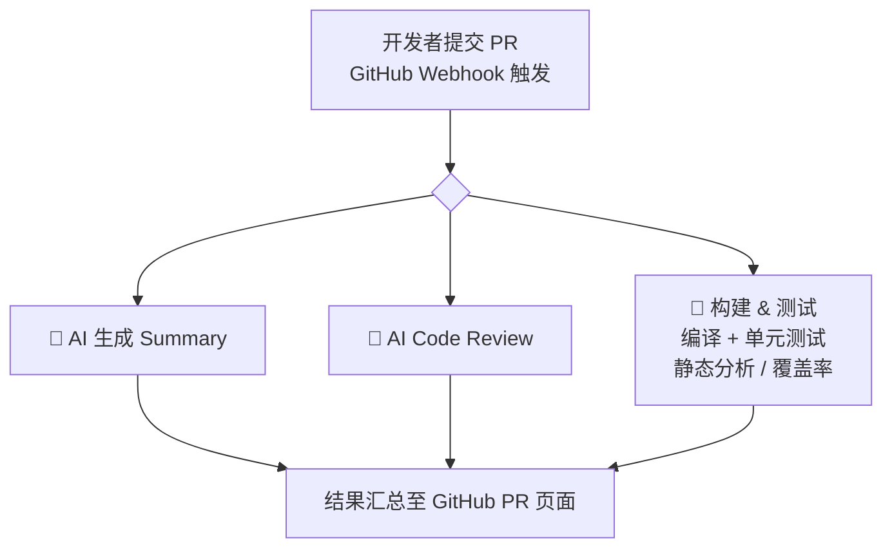
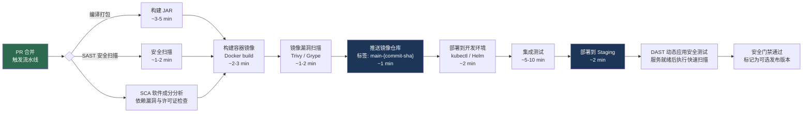
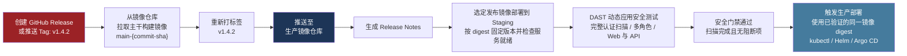

# 非托管环境的容器化交付流水线

> 当平台不再帮你"兜底"，你需要自己管好从代码到 Kubernetes 的每一步

---

## 写在前面

在[上一篇文章](../01-release-pipeline-overview/README.md)中，我们介绍了托管平台上的交付流水线——开发者只需提交代码，平台负责一切。

但现实中，很多团队运行在**非托管环境**：自建服务器、云厂商的原生 Kubernetes 集群、或者混合云架构。在这类环境中，"部署"不再是平台的内置能力，而是需要团队自己设计和维护的一套流程：

- 构建之后，还需要把应用打包进容器镜像
- 镜像需要推送到镜像仓库，才能被集群拉取
- Kubernetes 不会自动知道"有新版本了"，需要显式触发发布

这些额外的步骤，每一步都有可能出错，也都有最佳实践可以遵循。

---

## 托管 vs 非托管：流水线的差异

| 环节 | 托管平台 | 非托管环境 |
|------|----------|-----------|
| 构建产物 | JAR / WAR，平台运行时直接执行 | JAR 只是中间产物，还需打包成容器镜像 |
| 镜像管理 | 平台内置，开发者无感知 | 需自行维护 Dockerfile、镜像标签策略、仓库权限 |
| 部署触发 | 平台自动接管 | 需显式调用 kubectl / Helm / Argo CD |
| 环境隔离 | 平台划分，开发者声明即可 | 需自行管理 Namespace、ConfigMap、Secret |
| 回滚 | 平台一键回滚 | 需重新部署旧版本镜像，或借助 GitOps 回滚 |

---

## 三个关键时间点（与托管环境相同）

非托管环境同样围绕三个时间点触发流水线，区别在于每条流水线内部的步骤更多：


---

## 第一关：PR 流水线

PR 流水线的目标与托管环境相同——在合并前验证质量。不同之处在于，非托管环境通常不会在 PR 阶段做完整的镜像构建（成本太高），而是聚焦在**代码层面的验证**：



> 非托管环境的 PR 流水线通常**不构建镜像、不部署 Feature 环境**，以控制成本和速度。如果团队有条件，可以构建一个轻量级的 Preview 镜像用于集成验证，但这不是必须的。

---

## 第二关：主干流水线

PR 合并后，主干流水线比托管环境多出**镜像构建和推送**两个关键步骤：



### 各步骤说明

| 步骤 | 说明 | 关键决策 |
|------|------|----------|
| **构建 JAR** | 编译源码，运行单元测试 | 失败则整条流水线终止 |
| **安全扫描（SAST）** | 静态代码安全分析，与编译并行 | 高危漏洞应阻断流水线 |
| **SCA（软件成分分析）** | 检查直接及传递依赖的已知漏洞与许可证风险 | 违反准入策略则阻断镜像构建 |
| **构建容器镜像** | 执行 Dockerfile，将 JAR 打包进基础镜像 | 镜像分层设计影响构建速度和镜像体积 |
| **镜像漏洞扫描** | 扫描镜像中的 OS 包和依赖库漏洞（Trivy / Grype） | 区分镜像漏洞与代码漏洞，分别治理 |
| **推送镜像仓库** | 将镜像推送至 ECR / Harbor / Artifactory | 标签策略决定回滚能力 |
| **部署到开发环境** | 更新 Kubernetes Deployment 的镜像版本 | kubectl set image 或 Helm upgrade |
| **集成测试** | 在真实 K8s 环境中验证服务间协作 | 失败则 Staging 不会收到新版本 |
| **部署到 Staging** | 晋级到与生产同构的预发环境 | 确认服务就绪，供后续动态安全测试使用 |
| **DAST（动态应用安全测试）** | 对 Staging 的关键 Web / API 路径执行限时快速扫描 | 扫描成功且无阻断项后，才可标记为可选发布版本 |

### 安全测试如何配合

**SAST（静态应用安全测试）** 检查代码中的潜在安全缺陷，**SCA（软件成分分析）** 检查第三方组件的已知漏洞与许可证风险，**DAST（动态应用安全测试）** 检查运行中的应用或 API。三者的原理、优点与局限，见上一篇的[安全测试：SAST、DAST 与 SCA](../01-release-pipeline-overview/README.md#安全测试sastdast-与-sca)。

在本篇的容器流水线中，**SAST** 和 **SCA** 在构建阶段执行，镜像构建后继续检查实际交付的 OS 包和应用依赖漏洞。**DAST** 在主干的 Staging 部署完成后执行快速扫描，在发布流水线中对选定版本执行更完整的认证扫描。现有的集成测试不能替代 **DAST**，而镜像扫描也不能替代代码安全分析。

### 镜像标签策略

```
my-service:main-a1b2c3d    ← 主干构建，以 commit SHA 标记
my-service:latest           ← 指向最新主干构建（不推荐用于生产部署）
```

> **不要在生产部署中使用 `latest` 标签**。`latest` 是可变的，同一标签在不同时间拉取可能得到不同的镜像，导致部署结果不可预测，也无法精确回滚。

---

## 第三关：发布流水线

发布流水线的核心原则不变：**复用已验证的制品，不重新构建**。



### 发布安全门禁

| 步骤 | 说明 | 阻断条件 |
|------|------|------|
| **部署选定版本到 Staging** | 使用本次 Release 对应的镜像 digest，固定扫描期间的版本并确认服务就绪 | 版本不匹配或服务不可用 |
| **DAST（动态应用安全测试）** | 使用专用测试账号和数据执行完整认证扫描，覆盖多角色会话及 Web / API；报告关联镜像 digest | 达到阻断阈值的漏洞（例如高危或严重漏洞）、扫描失败、超时或登录失败 |
| **生产部署** | 仅在发布 **DAST** 通过后，部署同一 digest 的镜像 | 发布安全门禁未通过 |

主干 **DAST** 用于快速反馈，发布 **DAST** 用于对选定制品做更完整的上线前检查。主干快速扫描同样会因达到阻断阈值的漏洞或扫描未成功完成而失败。推送生产镜像仓库不代表已获准部署；生产部署必须等待安全门禁通过。

### 生产部署策略

非托管环境需要团队自行选择部署策略，不同策略的风险和复杂度不同：

| 策略 | 原理 | 优点 | 缺点 |
|------|------|------|------|
| **滚动更新（Rolling Update）** | 逐步替换旧 Pod，K8s 默认行为 | 零额外资源消耗，简单 | 新旧版本短暂共存，有兼容性风险 |
| **蓝绿部署（Blue/Green）** | 同时运行新旧两套环境，切换流量 | 瞬间切换，回滚极快 | 短期资源翻倍 |
| **金丝雀发布（Canary）** | 先将少量流量（如 5%）切到新版本 | 风险最低，问题早发现 | 实现复杂，需流量管控能力 |

### 回滚

非托管环境的回滚本质上是**重新部署旧版本镜像**：

```bash
# 方式一：直接指定旧镜像版本
kubectl set image deployment/my-service my-service=my-service:v1.4.1

# 方式二：使用 Kubernetes 内置回滚（回到上一个 ReplicaSet）
kubectl rollout undo deployment/my-service

# 方式三：GitOps 方式——在 Git 中 revert 版本号变更，流水线自动触发
git revert <commit>  # revert 修改镜像 tag 的那次提交
```

---

## 与托管环境流水线的对比

| 维度 | 托管平台 | 非托管环境 |
|------|----------|-----------|
| **开发者关注点** | 代码质量，其余交给平台 | 代码 + 镜像 + 部署配置 |
| **主干流水线复杂度** | 低（构建 → 测试 → 部署） | 高（构建 → 镜像 → 扫描 → 推送 → 部署 → 测试） |
| **制品形态** | JAR | 容器镜像 |
| **部署控制粒度** | 平台决定 | 团队完全自控（策略、节奏、资源） |
| **回滚速度** | 平台一键 | 取决于部署策略，蓝绿最快 |
| **学习成本** | 低 | 高（需要 Docker、K8s、Helm 等知识） |

---

## 延伸阅读

- [托管环境的软件发布流水线](../01-release-pipeline-overview/README.md)
- [制品仓库与版本策略](../README.md#制品仓库)
- [容器镜像最佳实践](../README.md#制品打包)
